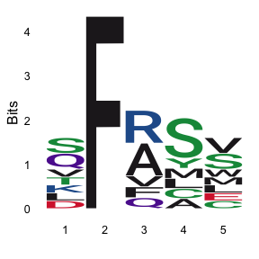
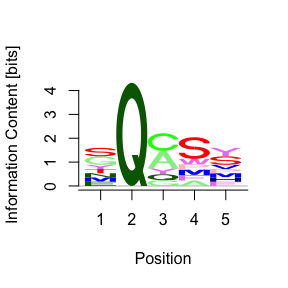
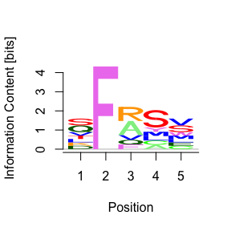
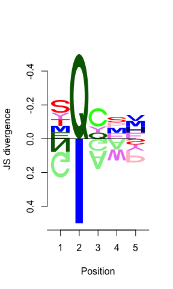
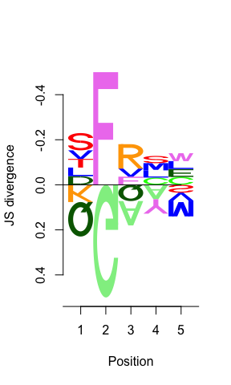

DiffLogo tests
================
Janet Young

2026-01-21

Goal - test some issues with DiffLogo.

Filed an issue here: <https://github.com/mgledi/DiffLogo/issues/31>

# Load libraries

``` r
knitr::opts_chunk$set(echo=TRUE)
library(tidyverse)
library(Biostrings)
library(ggseqlogo)
library(DiffLogo)
library(motifStack)
```

## Make test amino acid alignments

Create two alignments, so we can test DiffLogo as well as single logo
plots.

NOTICE that in `aa_aln_1`, second position is always F, in `aa_aln_2`
it’s always G. This is how we’ll know whether the plot is correct or
not.

``` r
aa_aln_1 <- AAStringSet(c("QFQSM", "QFAYS", "KFAAV", 
                          "LFRCW", "SFFSS", "DFRSL",
                          "VFRSV", "TFAMC", "SFVLE"))
aa_aln_2 <- AAStringSet(c("QGQSM", "QGAYS", "KGAAV"))
```

## Get raw counts and freq matrix

First get counts and frequencies for the entire alignment:

``` r
#### counts and freqs for aa_aln_1
# consensusMatrix is a Biostrings function that counts amino acids at each position
aa_aln_counts_matrix_1 <- consensusMatrix(aa_aln_1)[1:20,]

# pcm2pfm is a function from motifStack
# we also convert to data frame to avoid a warning from DiffLogo
aa_aln_freq_matrix_1 <- pcm2pfm(aa_aln_counts_matrix_1) |> 
    as.data.frame()

#### counts and freqs for aa_aln_2}
aa_aln_counts_matrix_2 <- consensusMatrix(aa_aln_2)[1:20,]

aa_aln_freq_matrix_2 <- pcm2pfm(aa_aln_counts_matrix_2) |> 
    as.data.frame()
```

Show counts for `aa_aln_1`

``` r
aa_aln_counts_matrix_1
```

    ##   [,1] [,2] [,3] [,4] [,5]
    ## A    0    0    3    1    0
    ## R    0    0    3    0    0
    ## N    0    0    0    0    0
    ## D    1    0    0    0    0
    ## C    0    0    0    1    1
    ## Q    2    0    1    0    0
    ## E    0    0    0    0    1
    ## G    0    0    0    0    0
    ## H    0    0    0    0    0
    ## I    0    0    0    0    0
    ## L    1    0    0    1    1
    ## K    1    0    0    0    0
    ## M    0    0    0    1    1
    ## F    0    9    1    0    0
    ## P    0    0    0    0    0
    ## S    2    0    0    4    2
    ## T    1    0    0    0    0
    ## W    0    0    0    0    1
    ## Y    0    0    0    1    0
    ## V    1    0    1    0    2

## Make logo with ggseqlogo

For comparison, make a logo plot with ggseqlogo

``` r
## I use the freq matrix rather than the seqs, to avoid ggseqlogo's small sample correction
ggseqlogo(as.matrix(aa_aln_freq_matrix_1),
          method="bits") +
    guides(fill="none")
```

    ## Warning: `aes_string()` was deprecated in ggplot2 3.0.0.
    ## ℹ Please use tidy evaluation idioms with `aes()`.
    ## ℹ See also `vignette("ggplot2-in-packages")` for more information.
    ## ℹ The deprecated feature was likely used in the ggseqlogo package.
    ##   Please report the issue at <https://github.com/omarwagih/ggseqlogo/issues>.
    ## This warning is displayed once every 8 hours.
    ## Call `lifecycle::last_lifecycle_warnings()` to see where this warning was
    ## generated.

<!-- -->

## Make DiffLogo::seqLogo single logo plot

The rows of the matrix are NOT in the same order as ASN\$chars so the
single DiffLogo looks WRONG! DiffLogo doesn’t check matrix order.

``` r
DiffLogo::seqLogo(aa_aln_freq_matrix_1, 
                  alphabet = ASN,
                  drawLines=20)
```

<!-- -->

We can get the correct plot if we reorder the matrix rows to match the
alphabet order:

``` r
DiffLogo::seqLogo(aa_aln_freq_matrix_1[ASN$chars,], 
                  alphabet = ASN,
                  drawLines=20)
```

<!-- -->

Same is true for the diffLogoFromPwm function - we get the wrong letters
in the plot unless we reorder the matrix rows to match the Alphabet’s
chars.

Here’s the wrong plot:

``` r
diffLogoFromPwm( aa_aln_freq_matrix_2,
                 aa_aln_freq_matrix_1, 
                 alphabet = ASN,
                 align_pwms=FALSE)
```

<!-- -->

Here’s the correct plot, after reordering the matrices to match ASN
order:

``` r
diffLogoFromPwm( aa_aln_freq_matrix_2[ASN$chars,],
                 aa_aln_freq_matrix_1[ASN$chars,], 
                 alphabet = ASN,
                 align_pwms=FALSE)
```

<!-- -->

# Finished

show R version used, and package versions

``` r
sessionInfo()
```

    ## R version 4.5.2 (2025-10-31)
    ## Platform: aarch64-apple-darwin20
    ## Running under: macOS Tahoe 26.2
    ## 
    ## Matrix products: default
    ## BLAS:   /System/Library/Frameworks/Accelerate.framework/Versions/A/Frameworks/vecLib.framework/Versions/A/libBLAS.dylib 
    ## LAPACK: /Library/Frameworks/R.framework/Versions/4.5-arm64/Resources/lib/libRlapack.dylib;  LAPACK version 3.12.1
    ## 
    ## locale:
    ## [1] en_US.UTF-8/en_US.UTF-8/en_US.UTF-8/C/en_US.UTF-8/en_US.UTF-8
    ## 
    ## time zone: America/Los_Angeles
    ## tzcode source: internal
    ## 
    ## attached base packages:
    ## [1] grid      stats4    stats     graphics  grDevices utils     datasets 
    ## [8] methods   base     
    ## 
    ## other attached packages:
    ##  [1] motifStack_1.54.0   DiffLogo_2.34.0     cba_0.2-25         
    ##  [4] proxy_0.4-28        ggseqlogo_0.2       Biostrings_2.78.0  
    ##  [7] Seqinfo_1.0.0       XVector_0.50.0      IRanges_2.44.0     
    ## [10] S4Vectors_0.48.0    BiocGenerics_0.56.0 generics_0.1.4     
    ## [13] lubridate_1.9.4     forcats_1.0.1       stringr_1.6.0      
    ## [16] dplyr_1.1.4         purrr_1.2.0         readr_2.1.6        
    ## [19] tidyr_1.3.1         tibble_3.3.0        ggplot2_4.0.1      
    ## [22] tidyverse_2.0.0    
    ## 
    ## loaded via a namespace (and not attached):
    ##  [1] ade4_1.7-23                 tidyselect_1.2.1           
    ##  [3] farver_2.1.2                blob_1.2.4                 
    ##  [5] S7_0.2.1                    bitops_1.0-9               
    ##  [7] fastmap_1.2.0               RCurl_1.98-1.17            
    ##  [9] GenomicAlignments_1.46.0    XML_3.99-0.20              
    ## [11] digest_0.6.39               DirichletMultinomial_1.52.0
    ## [13] timechange_0.3.0            lifecycle_1.0.4            
    ## [15] pwalign_1.6.0               RSQLite_2.4.5              
    ## [17] magrittr_2.0.4              compiler_4.5.2             
    ## [19] rlang_1.1.6                 tools_4.5.2                
    ## [21] yaml_2.3.12                 rtracklayer_1.70.0         
    ## [23] knitr_1.50                  labeling_0.4.3             
    ## [25] S4Arrays_1.10.1             htmlwidgets_1.6.4          
    ## [27] bit_4.6.0                   curl_7.0.0                 
    ## [29] DelayedArray_0.36.0         RColorBrewer_1.1-3         
    ## [31] abind_1.4-8                 BiocParallel_1.44.0        
    ## [33] withr_3.0.2                 caTools_1.18.3             
    ## [35] scales_1.4.0                gtools_3.9.5               
    ## [37] MASS_7.3-65                 SummarizedExperiment_1.40.0
    ## [39] cli_3.6.5                   rmarkdown_2.30             
    ## [41] crayon_1.5.3                rstudioapi_0.17.1          
    ## [43] TFMPvalue_0.0.9             httr_1.4.7                 
    ## [45] tzdb_0.5.0                  rjson_0.2.23               
    ## [47] DBI_1.2.3                   cachem_1.1.0               
    ## [49] parallel_4.5.2              restfulr_0.0.16            
    ## [51] matrixStats_1.5.0           vctrs_0.6.5                
    ## [53] Matrix_1.7-4                hms_1.1.4                  
    ## [55] bit64_4.6.0-1               seqLogo_1.76.0             
    ## [57] glue_1.8.0                  TFBSTools_1.48.0           
    ## [59] codetools_0.2-20            stringi_1.8.7              
    ## [61] gtable_0.3.6                GenomicRanges_1.62.1       
    ## [63] BiocIO_1.20.0               pillar_1.11.1              
    ## [65] htmltools_0.5.9             BSgenome_1.78.0            
    ## [67] R6_2.6.1                    lattice_0.22-7             
    ## [69] evaluate_1.0.5              Biobase_2.70.0             
    ## [71] cigarillo_1.0.0             Rsamtools_2.26.0           
    ## [73] memoise_2.0.1               Rcpp_1.1.0                 
    ## [75] SparseArray_1.10.6          xfun_0.54                  
    ## [77] MatrixGenerics_1.22.0       pkgconfig_2.0.3
