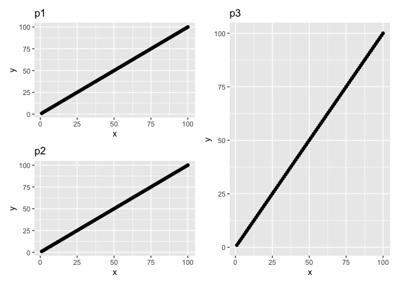
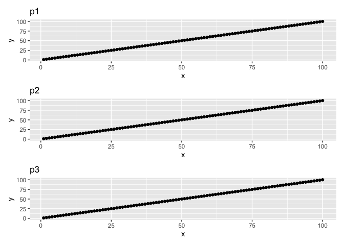

ggedit_patchwork_trouble
================
Janet Young

2025-06-05

Load packages

``` r
knitr::opts_chunk$set(echo = TRUE)
library("tidyverse")
```

    ## ── Attaching core tidyverse packages ──────────────────────── tidyverse 2.0.0 ──
    ## ✔ dplyr     1.1.4     ✔ readr     2.1.5
    ## ✔ forcats   1.0.0     ✔ stringr   1.5.1
    ## ✔ ggplot2   3.5.2     ✔ tibble    3.2.1
    ## ✔ lubridate 1.9.4     ✔ tidyr     1.3.1
    ## ✔ purrr     1.0.4     
    ## ── Conflicts ────────────────────────────────────────── tidyverse_conflicts() ──
    ## ✖ dplyr::filter() masks stats::filter()
    ## ✖ dplyr::lag()    masks stats::lag()
    ## ℹ Use the conflicted package (<http://conflicted.r-lib.org/>) to force all conflicts to become errors

``` r
library("patchwork")
```

Make some plots

``` r
dat <- tibble(x=1:100, y=1:100, type=rep(c("A","B","C","D"), each=25))

p1 <- dat %>% 
    ggplot(aes(x=x, y=y)) +
    geom_point() + 
    labs(title="p1")

p2 <- p1 + 
    labs(title="p2")

p3 <- p1 +
    labs(title="p3")
```

Show plots in desired layout - works fine with only tidyverse and
patchwork loaded

``` r
(p1 / p2) | p3  
```

<!-- -->

Use `+` not `|` and we get a different layout (no error)

``` r
(p1 / p2) + p3  
```

<!-- -->

Now we load ggedit package (but don’t edit the plots at all)

``` r
library("ggedit") 
```

    ## Registered S3 method overwritten by 'ggedit':
    ##   method from   
    ##   +.gg   ggplot2

Now patchwork fails when we use `|` rather than `+`

``` r
(p1 / p2) | p3 # , fig.height=5, fig.width=9
```

    ## Error: There are no null layers available in the plot to remove

It works if we replace `|` with `+` this isn’t the layout we want

``` r
(p1 / p2) + p3
```

<!-- -->

If we try using plot_layout (patchwork) we get a different error (even
though we’re still using \| not +)

``` r
(p1 / p2) | p3 + plot_layout(widths=c(1,2))
```

    ## Error in `l[[x]]`:
    ## ! Patchworks can only be indexed with numeric indices

Show `sessionInfo()`

``` r
sessionInfo()
```

    ## R version 4.4.2 (2024-10-31)
    ## Platform: aarch64-apple-darwin20
    ## Running under: macOS Sequoia 15.5
    ## 
    ## Matrix products: default
    ## BLAS:   /Library/Frameworks/R.framework/Versions/4.4-arm64/Resources/lib/libRblas.0.dylib 
    ## LAPACK: /Library/Frameworks/R.framework/Versions/4.4-arm64/Resources/lib/libRlapack.dylib;  LAPACK version 3.12.0
    ## 
    ## locale:
    ## [1] en_US.UTF-8/en_US.UTF-8/en_US.UTF-8/C/en_US.UTF-8/en_US.UTF-8
    ## 
    ## time zone: America/Los_Angeles
    ## tzcode source: internal
    ## 
    ## attached base packages:
    ## [1] stats     graphics  grDevices utils     datasets  methods   base     
    ## 
    ## other attached packages:
    ##  [1] ggedit_0.4.1    patchwork_1.3.0 lubridate_1.9.4 forcats_1.0.0  
    ##  [5] stringr_1.5.1   dplyr_1.1.4     purrr_1.0.4     readr_2.1.5    
    ##  [9] tidyr_1.3.1     tibble_3.2.1    ggplot2_3.5.2   tidyverse_2.0.0
    ## 
    ## loaded via a namespace (and not attached):
    ##  [1] generics_0.1.4     shinyBS_0.61.1     stringi_1.8.7      hms_1.1.3         
    ##  [5] digest_0.6.37      magrittr_2.0.3     evaluate_1.0.3     grid_4.4.2        
    ##  [9] timechange_0.3.0   RColorBrewer_1.1-3 fastmap_1.2.0      jsonlite_2.0.0    
    ## [13] promises_1.3.3     scales_1.4.0       cli_3.6.5          shiny_1.10.0      
    ## [17] rlang_1.1.6        withr_3.0.2        yaml_2.3.10        tools_4.4.2       
    ## [21] tzdb_0.5.0         httpuv_1.6.16      vctrs_0.6.5        R6_2.6.1          
    ## [25] mime_0.13          lifecycle_1.0.4    miniUI_0.1.2       pkgconfig_2.0.3   
    ## [29] pillar_1.10.2      later_1.4.2        shinyAce_0.4.4     gtable_0.3.6      
    ## [33] glue_1.8.0         Rcpp_1.0.14        xfun_0.52          tidyselect_1.2.1  
    ## [37] rstudioapi_0.17.1  knitr_1.50         farver_2.1.2       xtable_1.8-4      
    ## [41] htmltools_0.5.8.1  rmarkdown_2.29     labeling_0.4.3     compiler_4.4.2
