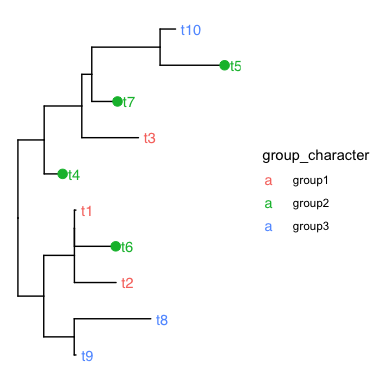
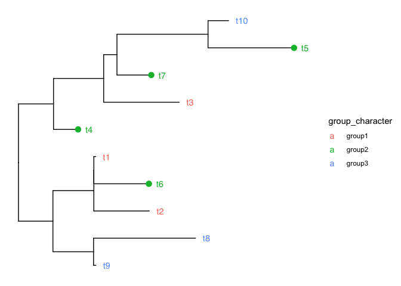

treeTests_troubleshoot_subsetting
================
Janet Young

2026-04-02

``` r
library(ape)
library(ggtree)
```

    ## ggtree v4.0.5 Learn more at https://yulab-smu.top/contribution-tree-data/
    ## 
    ## Please cite:
    ## 
    ## Guangchuang Yu. Using ggtree to visualize data on tree-like structures.
    ## Current Protocols in Bioinformatics. 2020, 69:e96. doi:10.1002/cpbi.96

    ## 
    ## Attaching package: 'ggtree'

    ## The following object is masked from 'package:ape':
    ## 
    ##     rotate

``` r
library(tidytree)
```

    ## tidytree v0.4.7 Learn more at https://yulab-smu.top/contribution-tree-data/
    ## 
    ## Please cite:
    ## 
    ## Guangchuang Yu, Tommy Tsan-Yuk Lam, Huachen Zhu, Yi Guan. Two methods
    ## for mapping and visualizing associated data on phylogeny using ggtree.
    ## Molecular Biology and Evolution. 2018, 35(12):3041-3043.
    ## doi:10.1093/molbev/msy194

    ## 
    ## Attaching package: 'tidytree'

    ## The following objects are masked from 'package:ape':
    ## 
    ##     drop.tip, keep.tip

    ## The following object is masked from 'package:stats':
    ## 
    ##     filter

``` r
### this is to let the doc show the errors and continue to knit
knitr::opts_chunk$set(echo = TRUE, error = TRUE)
# override error output hook here
knitr::knit_hooks$set(error = function(x, options) { 
  knitr::knit_exit()
})
```

# Get example tree data

Make a tree

``` r
tr <- rtree(10)
```

Make table of information about tips

``` r
tree_info <- data.frame(label = paste0("t",1:10),
                        group_character = c(rep("group1", 3),
                                               rep("group2", 4),
                                               rep("group3", 3)))

## add factor column:
tree_info[,"group_factor"] <- factor(tree_info[,"group_character"])

## add integer column:
tree_info[,"group_integer"] <- as.integer(gsub("group","",tree_info[,"group_character"]))

## add TRUE/FALSE column:
tree_info[,"in_group2"] <- tree_info[,"group_character"] == "group2"

tree_info
```

    ##    label group_character group_factor group_integer in_group2
    ## 1     t1          group1       group1             1     FALSE
    ## 2     t2          group1       group1             1     FALSE
    ## 3     t3          group1       group1             1     FALSE
    ## 4     t4          group2       group2             2      TRUE
    ## 5     t5          group2       group2             2      TRUE
    ## 6     t6          group2       group2             2      TRUE
    ## 7     t7          group2       group2             2      TRUE
    ## 8     t8          group3       group3             3     FALSE
    ## 9     t9          group3       group3             3     FALSE
    ## 10   t10          group3       group3             3     FALSE

Join info and tree together:

``` r
tr_plus_info <- left_join(tr, tree_info, by="label")
```

# Now plot

Plot, using `in_group2` column (TRUE/FALSE) to subset geom_tippoint -
works:

``` r
ggtree(tr_plus_info) +
    geom_tiplab(aes(color=group_character), offset=0.05) +
    geom_tippoint(aes(subset=in_group2, 
                      color=group_character),
                  size=3, 
                  show.legend = FALSE)
```

<!-- -->

Plot, using a logical test on the `group_integer` column
(group_integer==2) to subset geom_tippoint - this works:

``` r
ggtree(tr_plus_info) +
    geom_tiplab(aes(color=group_character), offset=0.05) +
    geom_tippoint(aes(subset= (group_integer==2), 
                      color=group_character),
                  size=3, 
                  show.legend = FALSE)
```

<!-- -->

Plot, using a logical test on the `group_factor` column
(group_factor==“group2”) to subset geom_tippoint - this fails:

``` r
ggtree(tr_plus_info) +
    geom_tiplab(aes(color=group_character), offset=0.05) +
    geom_tippoint(aes(subset= (group_factor=="group2"), 
                      color=group_character),
                  size=3, 
                  show.legend = FALSE)
```
